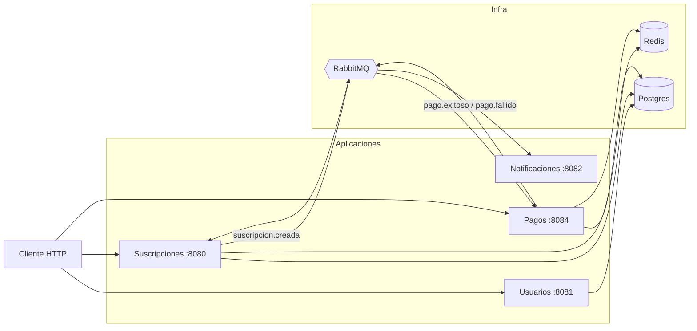
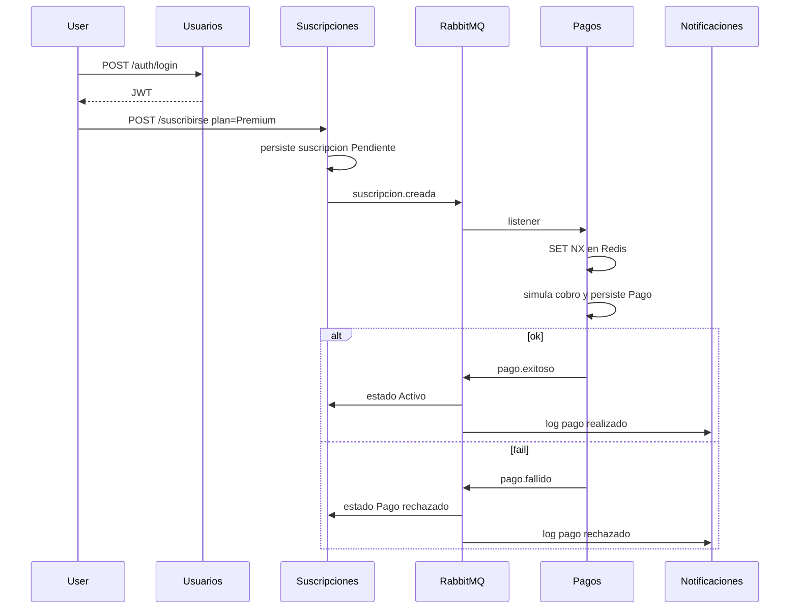
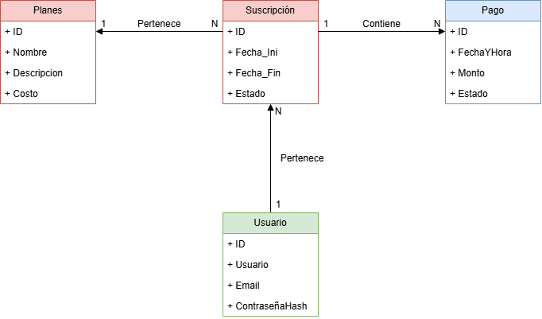

# Spring Suscripciones

Plataforma de suscripciones (estilo streaming) armada con **cuatro microservicios** en Spring Boot. El flujo de negocio no se resuelve con un REST encadenado: se crea la suscripción, se publica un evento, pagos cobra (simulado) y el resto se entera por RabbitMQ.

Lo hice así a propósito. Un monolito hubiera sido más corto; la idea del repo es practicar el recorte de bounded contexts, mensajería e infra que después aparece en cualquier entrevista de backend.

## Stack

- Java 21, Spring Boot 4
- PostgreSQL (una instancia, **tres databases**)
- RabbitMQ
- Redis (cache de planes + idempotencia de cobros)
- JWT entre servicios
- Docker Compose para levantar todo

## Cómo levantarlo

Hace falta Docker Desktop. La primera vez Maven compila las cuatro imágenes; puede tardar un rato.

```bash
git clone https://github.com/NatsukiAza/springsuscripciones.git
cd springsuscripciones
cp .env.example .env
docker compose up --build
```

En Windows: `copy .env.example .env`. Editá `POSTGRES_PASSWORD` si querés; Compose se lo pasa a Postgres y a las apps.

Cuando terminen de loguear `Started ...Application`:

| Servicio       | Puerto | Para qué               |
| -------------- | ------ | ---------------------- |
| Usuarios       | 8081   | registro / login       |
| Suscripciones  | 8080   | planes y suscripciones |
| Pagos          | 8084   | cobro + webhook        |
| Notificaciones | 8082   | “mail” por consola     |
| RabbitMQ UI    | 15672  | guest / guest          |

Postgres (`5432`) y Redis (`6379`) quedan publicados para debuggear desde la máquina; no hace falta tocarlos para usar la API.

Parar:

```bash
docker compose down
```

`down -v` además tira el volume de Postgres. Útil si cambiaste el `init.sql` y las databases no aparecen.

### Probar el flujo (muy resumido)

1. `POST http://localhost:8081/auth/registrarse` y después `/auth/login` → te devuelve un JWT.
2. Con el token, `POST http://localhost:8080/plan/crear` y `POST http://localhost:8080/suscribirse?plan=Premium`.
3. Pagos consume `suscripcion.creada`, simula el cobro (~70% ok) y publica `pago.exitoso` o `pago.fallido`.
4. Suscripciones pasa la suscripción a `Activo` o `Pago rechazado`. Notificaciones imprime el resultado en el log del contenedor.

## Arquitectura

Cuatro procesos, no cuatro carpetas dentro del mismo jar. Cada uno que persiste tiene **su** database. Notificaciones no tiene DB: solo escucha y escribe a stdout. Si mañana el mail fuera SendGrid, ese servicio es el único que cambia.



Usuarios no publica eventos. Autentica y listo: el JWT viaja en el `Authorization` de las otras APIs.

### Qué pasa cuando alguien se suscribe



Pagos y notificaciones se enganchan al mismo exchange de pagos (routing keys `pago-exitoso` / `pago-fallido`). Suscripciones actualiza estado; notificaciones no necesita saber de tablas.

## Modelo de dominio

El recorte que me importaba: **Usuario**, **Plan**, **Suscripción**, **Pago**. La suscripción es el medio. El pago no vive en el servicio de suscripciones; solo se referencia por ids. Eso es medio incómodo (no hay join lindo), pero es el punto de no compartir schema.



Hay más diagramas de draw.io (clases, etc.) que voy a ir dejando en `/public` cuando los tenga prolijos.

## Por qué estas decisiones

**Base por servicio, no una sola con todas las tablas.** Si pagos hace `SELECT` a `usuarios`, en la práctica volviste a un monolito. En local (y en un RDS barato) igual uso **un** Postgres y tres databases (`usuarios`, `suscripciones`, `pagos`). Tres motores eran overkill para este tamaño.

**Rabbit para el flujo, HTTP para lo puntual.** Crear suscripción no puede quedar bloqueado esperando al cobro. Login y “¿existe este plan?” sí son request/response. No hay Feign todavía; no hizo falta.

**Redis para dos cosas distintas**, no “porque hay que tener cache”:

- En suscripciones, `@Cacheable` sobre `mostrarPlan`. Un plan se pide siempre por nombre y casi no cambia. `crearPlan` hace `@CacheEvict` de todo el cache `planes` (son pocos; me pareció más simple que pelearme con keys sueltas).
- En pagos, `SET NX` con TTL 24h. Rabbit reentrega. Stripe también. Sin eso, el mismo `suscripcion.creada` cobra dos veces. La key del listener es `suscripcion:{id}`; el webhook usa el header `Idempotency-Key`.

**Cobro simulado.** Un `Random` 70/30. No hay Mercado Pago ni Stripe de verdad; el webhook está para practicar el contrato (header + misma lógica de idempotencia).

**Notificaciones = log.** Un SMTP en este repo no sumaba. El servicio existe para que el evento tenga un consumer que no sea suscripciones.

**Compose, no Kubernetes.** Con cuatro apps y tres pieces de infra, Compose es lo que un reclutador puede clonar a la noche. AWS (EC2 / ECS + RDS) lo dejo para cuando el README y el flujo local estén cerrados.

**`ddl-auto=update`.** Sirve para iterar. No es el endgame: el siguiente paso serio es Flyway. Lo dejo anotado acá para no venderme la moto.

## Estructura del repo

```
ServicioUsuarios/
ServicioSuscripciones/
ServicioPagos/
ServicioNotificaciones/
docker/postgres/init.sql    # CREATE DATABASE de las tres
docker-compose.yml
.env.example
public/                     # diagramas
```

Cada servicio trae su `Dockerfile` (build Maven + JRE 21). Redis/Postgres/Rabbit **no** van adentro de esas imágenes: son contenedores aparte.

## Tests

Hay tests unitarios con JUnit 5 + Mockito en los cuatro servicios (servicios, listeners, JWT, handlers). Los `*ApplicationTests` de contexto completo están deshabilitados: piden Rabbit/Postgres y no son el punto de `mvn test` en frío.

```bash
cd ServicioSuscripciones
./mvnw test
```

En Windows: `.\mvnw.cmd test`.

## Cosas que sé que faltan

- Flyway en vez de `update`
- Gateway / un solo puerto hacia afuera
- Mails de verdad
- Un PSP real

Si algo no levanta, lo primero que hay que mirar es: `.env` copiado, Docker con RAM decente (cuatro JVMs no entran en 1 GB) y `docker compose logs -f`.
