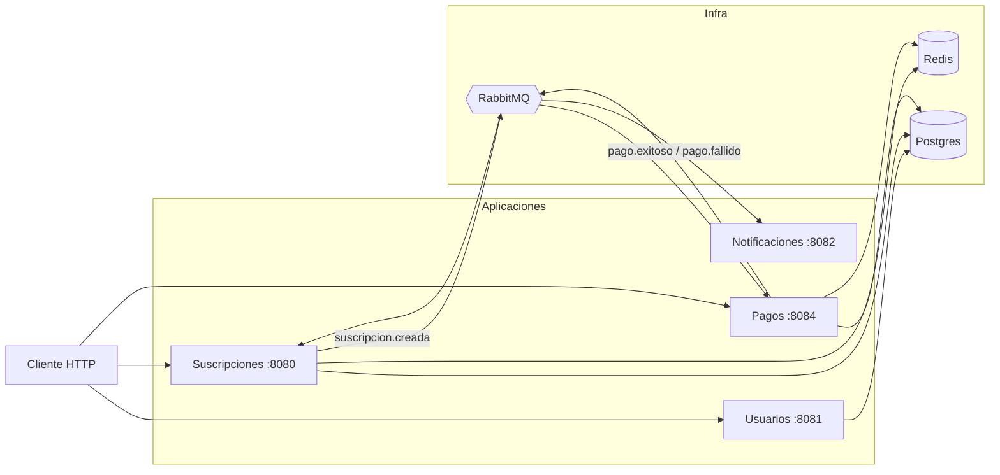
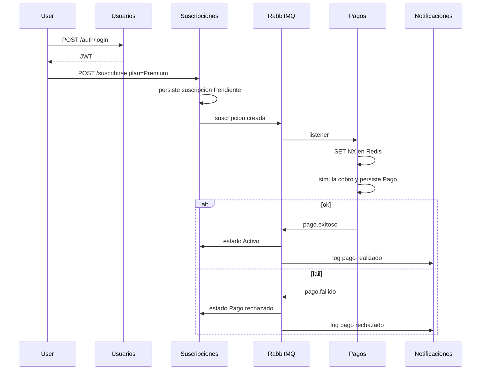

# Spring Suscripciones

Plataforma de suscripciones (estilo streaming) armada con **cuatro microservicios** en Spring Boot. El flujo de negocio no se resuelve con un REST encadenado: se crea la suscripción, se publica un evento, pagos cobra (simulado) y el resto se entera por RabbitMQ.

Lo hice así a propósito. Un monolito hubiera sido más corto; la idea del repo es practicar el recorte de bounded contexts, mensajería e infra que después aparece en cualquier entrevista de backend.

## Stack

- Java 21, Spring Boot 4
- PostgreSQL (una instancia, **tres databases**)
- RabbitMQ
- Redis (cache de planes + idempotencia de cobros)
- JWT entre servicios
- OpenAPI 3 + Swagger UI (springdoc) en cada API HTTP
- Docker Compose para levantar todo

## Cómo levantarlo

Hace falta Docker Desktop. La primera vez Maven compila las cuatro imágenes; puede tardar un rato.

```bash
git clone https://github.com/NatsukiAza/springsuscripciones.git
cd springsuscripciones
cp .env.example .env
docker compose up --build
```

En Windows: `copy .env.example .env`. Editá `POSTGRES_PASSWORD` si querés; Compose se lo pasa a Postgres y a las apps.

Cuando terminen de loguear `Started ...Application`:

| Servicio       | Puerto | Para qué               | Página en el browser |
| -------------- | ------ | ---------------------- | -------------------- |
| Usuarios       | 8081   | registro / login       | http://localhost:8081/swagger-ui.html |
| Suscripciones  | 8080   | planes y suscripciones | http://localhost:8080/swagger-ui.html |
| Pagos          | 8084   | cobro + webhook        | http://localhost:8084/swagger-ui.html |
| Notificaciones | 8082   | “mail” por consola     | — (no tiene REST) |
| RabbitMQ UI    | 15672  | guest / guest          | http://localhost:15672 |

La columna de la derecha no es un programa para instalar. Cada servicio HTTP **ya sirve** una página (Swagger UI) para ver y pegarle a su API. Abrís el link en Chrome/Firefox, igual que la UI de Rabbit. Hay tres páginas porque hay tres APIs; el JWT no salta solo de una a la otra.

Postgres (`5432`) y Redis (`6379`) quedan publicados para debuggear desde la máquina; no hace falta tocarlos para usar la API.

Parar:

```bash
docker compose down
```

`down -v` además tira el volume de Postgres. Útil si cambiaste el `init.sql` y las databases no aparecen.

### Probar el flujo

#### 1. Registro y login

En el navegador abrí [http://localhost:8081/swagger-ui.html](http://localhost:8081/swagger-ui.html). Tiene que decir **Usuarios** arriba. Si no carga, el contenedor todavía no arrancó (`docker compose logs usuarios`).

1. Expandí `POST /auth/registrarse` → **Try it out**.
2. El JSON de ejemplo se puede editar. Mandá algo como `{"username":"santi","email":"santi@streamsub.com","password":"clave"}` y **Execute**.
3. Abajo, **Responses**: `200` es usuario creado; `409` es que ese username/email ya existía.
4. Expandí `POST /auth/login` → **Try it out** → el mismo username/password → **Execute**.
5. En el body de la respuesta copiá **solo** el valor de `token` (el `eyJ...`), sin comillas. Eso es el JWT.

Registro y login son públicos: acá no hace falta el candado **Authorize**.

#### 2. Plan y suscripción

Otra pestaña: [http://localhost:8080/swagger-ui.html](http://localhost:8080/swagger-ui.html) (**Suscripciones**). Esta API sí pide JWT.

1. Arriba a la derecha, **Authorize**. Pegá el token en Value. No escribas `Bearer ` adelante: la UI lo agrega sola. **Authorize** → **Close**.
2. `POST /plan/crear` → **Try it out** → por ejemplo `{"nombre":"premium","descripcion":"Full HD","costo":1500}` → **Execute**. `409` es plan duplicado; está bien si ya lo creaste.
3. `POST /suscribirse` → **Try it out** → en el query `plan` poné `premium` (el **nombre**, no el id) → **Execute**. La suscripción nace en `Pendiente`.

Si te olvidaste Authorize, acá ves `403`, no un JSON de negocio.

#### 3. El cobro (no hay botón en Swagger)

Pagos no se dispara desde esta UI. Escucha `suscripcion.creada` en Rabbit, simula el cobro (~70% ok) y publica `pago.exitoso` o `pago.fallido`.

Para ver cómo terminó, en la **misma** pestaña de `:8080` (con el JWT todavía autorizado): `GET /suscripcion` → **Try it out** → **Execute**. El `estado` pasa a `Activo` o `Pago rechazado`. Si sigue `Pendiente`, esperá un segundo y repetí.

Notificaciones no tiene página: imprime el mail simulado en el log:

```bash
docker compose logs -f notificaciones
```

El webhook de [http://localhost:8084/swagger-ui.html](http://localhost:8084/swagger-ui.html) es otro camino (el contrato de un PSP: header `Idempotency-Key`, sin JWT). El flujo de arriba **no** lo usa.

Si preferís curl/Postman en vez de la página: mismos paths, header `Authorization: Bearer <token>`. El spec crudo está en `/v3/api-docs` de cada puerto.

La versión automática de este flujo (más listeners y Redis) está en [Tests](#tests).

## Arquitectura

Cuatro procesos, no cuatro carpetas dentro del mismo jar. Cada uno que persiste tiene **su** database. Notificaciones no tiene DB: solo escucha y escribe a stdout. Si mañana el mail fuera SendGrid, ese servicio es el único que cambia.



Usuarios no publica eventos. Autentica y listo: el JWT viaja en el `Authorization` de las otras APIs.

### Qué pasa cuando alguien se suscribe



Pagos y notificaciones se enganchan al mismo exchange de pagos (routing keys `pago-exitoso` / `pago-fallido`). Suscripciones actualiza estado; notificaciones no necesita saber de tablas.

## Modelo de dominio

El recorte que me importaba: **Usuario**, **Plan**, **Suscripción**, **Pago**. La suscripción es el medio. El pago no vive en el servicio de suscripciones; solo se referencia por ids. Eso es medio incómodo (no hay join lindo), pero es el punto de no compartir schema.


Hay más diagramas de draw.io (clases, etc.) que voy a ir dejando en `/public` cuando los tenga prolijos.

## Por qué estas decisiones

**Base por servicio, no una sola con todas las tablas.** Si pagos hace `SELECT` a `usuarios`, en la práctica volviste a un monolito. En local (y en un RDS barato) igual uso **un** Postgres y tres databases (`usuarios`, `suscripciones`, `pagos`). Tres motores eran overkill para este tamaño.

**Rabbit para el flujo, HTTP para lo puntual.** Crear suscripción no puede quedar bloqueado esperando al cobro. Login y “¿existe este plan?” sí son request/response. No hay Feign todavía; no hizo falta.

**Redis para dos cosas distintas**, no “porque hay que tener cache”:

- En suscripciones, `@Cacheable` sobre `mostrarPlan`. Un plan se pide siempre por nombre y casi no cambia. `crearPlan` hace `@CacheEvict` de todo el cache `planes` (son pocos; me pareció más simple que pelearme con keys sueltas).
- En pagos, `SET NX` con TTL 24h. Rabbit reentrega. Stripe también. Sin eso, el mismo `suscripcion.creada` cobra dos veces. La key del listener es `suscripcion:{id}`; el webhook usa el header `Idempotency-Key`.

**Cobro simulado.** Un `Random` 70/30. No hay Mercado Pago ni Stripe de verdad; el webhook está para practicar el contrato (header + misma lógica de idempotencia).

**Notificaciones = log.** Un SMTP en este repo no sumaba. El servicio existe para que el evento tenga un consumer que no sea suscripciones.

**Compose, no Kubernetes.** Con cuatro apps y tres pieces de infra, Compose es lo que un reclutador puede clonar a la noche. AWS (EC2 / ECS + RDS) lo dejo para cuando el README y el flujo local estén cerrados.

**`ddl-auto=update`.** Sirve para iterar. No es el endgame: el siguiente paso serio es Flyway. Lo dejo anotado acá para no venderme la moto.

## Estructura del repo

```
ServicioUsuarios/
ServicioSuscripciones/
ServicioPagos/
ServicioNotificaciones/
docker/postgres/init.sql    # CREATE DATABASE de las tres
docker-compose.yml
.env.example
public/                     # diagramas
```

Cada servicio trae su `Dockerfile` (build Maven + JRE 21). Redis/Postgres/Rabbit **no** van adentro de esas imágenes: son contenedores aparte.

## Tests

Dos capas, en cada servicio:

**Unitarios** (JUnit 5 + Mockito): servicios, listeners, JWT, handlers. No piden Docker.

**Integración** (Testcontainers + `*ApplicationTests`): levantan Postgres, RabbitMQ y Redis de verdad (las mismas imágenes que Compose), pisan el datasource con `@ServiceConnection` y pegan a la API con MockMvc. Cubren registro/login, planes, suscribirse + evento, webhook + idempotencia, listeners y que `/v3/api-docs` + Swagger UI queden públicos.

Hace falta **Docker Desktop** para los IT. Sin el daemon, fallan al no encontrar un environment de Docker; los unitarios igual corren.

```bash
cd ServicioUsuarios && ./mvnw test
cd ServicioSuscripciones && ./mvnw test
cd ServicioPagos && ./mvnw test
cd ServicioNotificaciones && ./mvnw test
```

En Windows: `.\mvnw.cmd test`. Surefire incluye `*IT.java`, así que `mvn test` corre unitarios e integración juntos.

No se corren desde Swagger. Swagger **Try it out** es para el stack de Compose (puertos fijos `8080`/`8081`/`8084`): mismos endpoints HTTP que los IT, a mano, con JWT en **Authorize**. Lo que no es HTTP —listeners de Rabbit, `SET NX` en Redis, `contextLoads`— solo existe en `mvn test`. Notificaciones no tiene REST, así que tampoco Swagger.

## Cosas que sé que faltan

- Flyway en vez de `update`
- Gateway / un solo puerto hacia afuera
- Mails de verdad
- Un PSP real

Si algo no levanta, lo primero que hay que mirar es: `.env` copiado, Docker con RAM decente (cuatro JVMs no entran en 1 GB) y `docker compose logs -f`.
